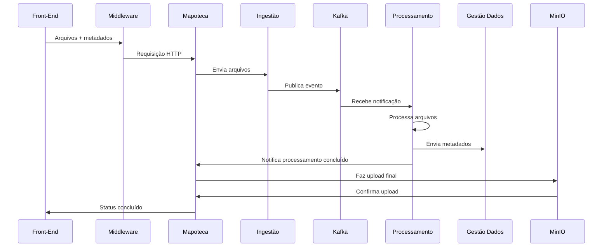
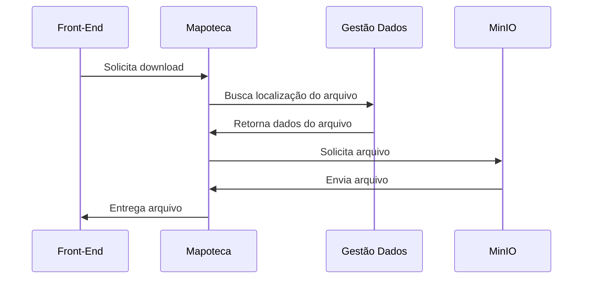
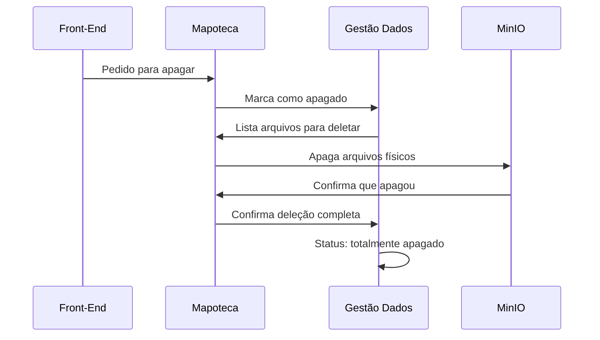

# Microsserviço Mapoteca

## 📋 Visão Geral

O **Microsserviço Mapoteca** é o **gerente de projetos central** da arquitetura de preservação digital. Ele atua como o único ponto de entrada para todas as operações do sistema, orquestrando o fluxo completo de preservação digital desde a ingestão até o acesso aos arquivos preservados.

## 🎯 Função Principal

O Mapoteca é responsável por:

- **Receber e gerenciar** todos os pedidos do Front-End (upload, download, deleção, renomeação)
- **Orquestrar** a comunicação entre todos os microsserviços
- **Rastrear o status** de cada operação em seu banco de dados próprio
- **Centralizar o controle** de acesso ao armazenamento MinIO
- **Garantir a integridade** dos fluxos de preservação digital

> 💡 **Analogia**: Imagine o Mapoteca como o gerente de uma fábrica digital que recebe todos os pedidos, delega tarefas aos departamentos corretos e acompanha o progresso até a conclusão.

## 🏗️ Arquitetura e Comunicação

### Posição na Arquitetura

```
Front-End → Middleware → 🎯 MAPOTECA → Outros Microsserviços
```

O Mapoteca é o **único microsserviço** que o Front-End conhece e conversa diretamente.

### Microsserviços da Arquitetura

#### Node.js/TypeScript (Camada de Orquestração)
- **🎯 Mapoteca** - Gerente central (este microsserviço)
- **📥 Ingestão** - Portaria da fábrica
- **💾 MinIO** - Armazém de arquivos
- **🔍 Acesso** - Vitrine para consultas

#### Python (Camada de Processamento)
- **⚙️ Processamento** - Departamento de qualidade
- **📊 Gestão de Dados** - Arquivo central de metadados
- **📅 Planejamento** - Estratégias de preservação

## 🔄 Fluxos de Comunicação

### 1. 📤 Fluxo de Upload (Envio de Arquivos)



**Como funciona:**
1. Front-End envia arquivos → Mapoteca
2. Mapoteca → Ingestão (salva temporariamente)
3. Ingestão → Kafka (avisa que há arquivos novos)
4. Processamento recebe aviso → processa os arquivos
5. Processamento → Gestão de Dados (salva informações)
6. Processamento → Mapoteca (avisa que terminou)
7. Mapoteca → MinIO (salva arquivos finais)
8. Mapoteca atualiza status do pedido

### 2. 📥 Fluxo de Download (Baixar Arquivos)



**Como funciona:**
1. Front-End pede um arquivo → Mapoteca
2. Mapoteca → Gestão de Dados (onde está o arquivo?)
3. Gestão de Dados → Mapoteca (está aqui!)
4. Mapoteca → MinIO (me dá o arquivo)
5. MinIO → Mapoteca (aqui está o arquivo)
6. Mapoteca → Front-End (entrega o arquivo)

### 3. 🗑️ Fluxo de Deleção (Apagar Arquivos)



**Como funciona:**
1. Front-End pede para apagar → Mapoteca
2. Mapoteca → Gestão de Dados (marca como "apagado")
3. Gestão de Dados → Mapoteca (lista quais arquivos apagar)
4. Mapoteca → MinIO (apaga os arquivos de verdade)
5. MinIO → Mapoteca (confirmação de que apagou)
6. Mapoteca → Gestão de Dados (tudo foi apagado)
7. Sistema atualiza status final


## 🔗 Protocolos de Comunicação

### APIs REST (Comunicação Direta)
- **Front-End ↔ Mapoteca**: Todas as operações
- **Mapoteca ↔ Ingestão**: Envio de arquivos
- **Mapoteca ↔ MinIO**: Upload/Download/Delete
- **Mapoteca ↔ Gestão de Dados**: Consultas de informações
- **Mapoteca ↔ Acesso**: Coordenação de consultas

### Kafka (Mensagens Assíncronas)
- **Mapoteca** recebe notificações:
  - `processing-completed`: Processamento concluído
  - `processing-failed`: Falha no processamento

## 🛡️ Restrições de Segurança

### Controle de Acesso ao MinIO
- **APENAS o Mapoteca** pode se comunicar com o MinIO
- Nenhum outro microsserviço tem acesso direto ao armazenamento
- Centraliza todas as regras de negócio de armazenamento

### Validações
- Autenticação de usuários
- Autorização de operações
- Validação de integridade de dados

## 💾 Banco de Dados

O Mapoteca possui seu próprio banco de dados (`mapoteca_db`) com a tabela principal:

### Tabela: Pedidos
```sql
- id: UUID (identificador único)
- tipo: UPLOAD | DOWNLOAD | DELETE | RENAME
- status: PENDING | PROCESSING | COMPLETED | FAILED
- usuarioId: string
- caminhoMinIO: string (localização no storage)
- mensagemErro: string (em caso de falha)
- createdAt: timestamp
- updatedAt: timestamp
```

## 🚀 Tecnologias

- **Runtime**: Node.js
- **Framework**: NestJS
- **Linguagem**: TypeScript
- **Banco de Dados**: PostgreSQL (via Prisma)
- **Mensageria**: Kafka
- **Containerização**: Docker

## 📦 Conceitos de Preservação Digital

### Tipos de Pacotes
- **Pacote Original**: Arquivos como chegam do usuário
- **Pacote Preservado**: Arquivos processados e validados
- **Pacote de Acesso**: Arquivos prontos para consulta pública

### Fluxo de Transformação
```
Arquivos Originais → [Processamento] → Arquivos Preservados → [Armazenamento] → Arquivos de Acesso
```

## 🔧 Configuração e Deploy

### Variáveis de Ambiente
```env
DATABASE_URL=postgresql://...
KAFKA_BROKERS=localhost:9092
MINIO_ENDPOINT=localhost:9000
INGESTAO_SERVICE_URL=http://ingestao:3001
GESTAO_DADOS_SERVICE_URL=http://gestao-dados:3002
MINIO_SERVICE_URL=http://minio-service:3003
```

### Docker Compose
O Mapoteca é orquestrado junto com todos os outros microsserviços via Docker Compose, garantindo a comunicação adequada entre os serviços.

## 📈 Monitoramento e Logs

- Logs estruturados de todas as operações
- Rastreamento de status de pedidos
- Métricas de performance
- Alertas de falhas de comunicação

## 🎯 Benefícios da Arquitetura

1. **Centralização**: Único ponto de controle para o Front-End
2. **Segurança**: Controle total sobre acesso ao armazenamento
3. **Escalabilidade**: Cada microsserviço pode escalar independentemente
4. **Resiliência**: Falhas isoladas não afetam todo o sistema
5. **Manutenibilidade**: Responsabilidades bem definidas

---

> 💡 **Resumo**: O Mapoteca é o maestro da orquestra de preservação digital, garantindo que cada arquivo seja processado, preservado e disponibilizado de forma segura e eficiente.